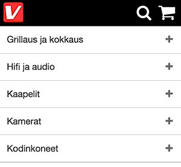

# sneakpeek



Hides header when scrolling down. Shows header when scrolling up. No external
dependencies. Similar to
[Headroom.js](https://github.com/WickyNilliams/headroom.js). Weighs less than
1kB gzipped.

Try the [demo](http://bit.ly/1tAdLHN).

It shows/hides the header by toggling a `sneakpeek--hidden` class.

```html
<!-- initially -->
<header>

<!-- scrolling down -->
<header class="sneakpeek--hidden">

<!-- scrolling up -->
<header>
```

Style it however you want.

## Install

Install from npm:

    npm install sneakpeek

## Usage

With browserify:

```js
sneakpeek = require('sneakpeek')
sneakpeek(document.getElementById('header'))
```

Regular script tags:

```html
<script src="index.js"></script>
<script>
  sneakpeek(document.getElementById('header'))
</script>
```

### Events

If you don't want to switch a class as a side effect, but decide yourself on
what to do when the user scrolls up or down, use `sneakpeek.emitter`:

```js
emitter = require('sneakpeek').emitter

emitter.on('hide', function() { console.log('user scolled down, header hidden') })
emitter.on('show', function() { console.log('user scrolled up, header shown')  })
```

## License

Licensed under the [MIT License](http://www.opensource.org/licenses/mit-license.php).